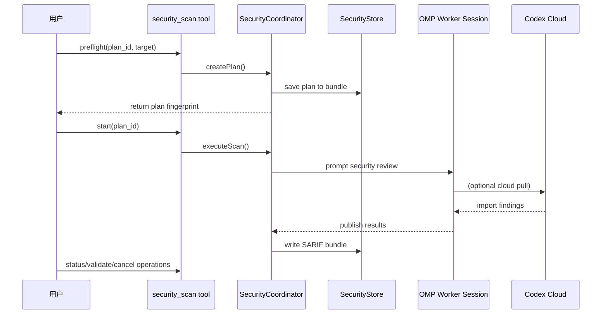
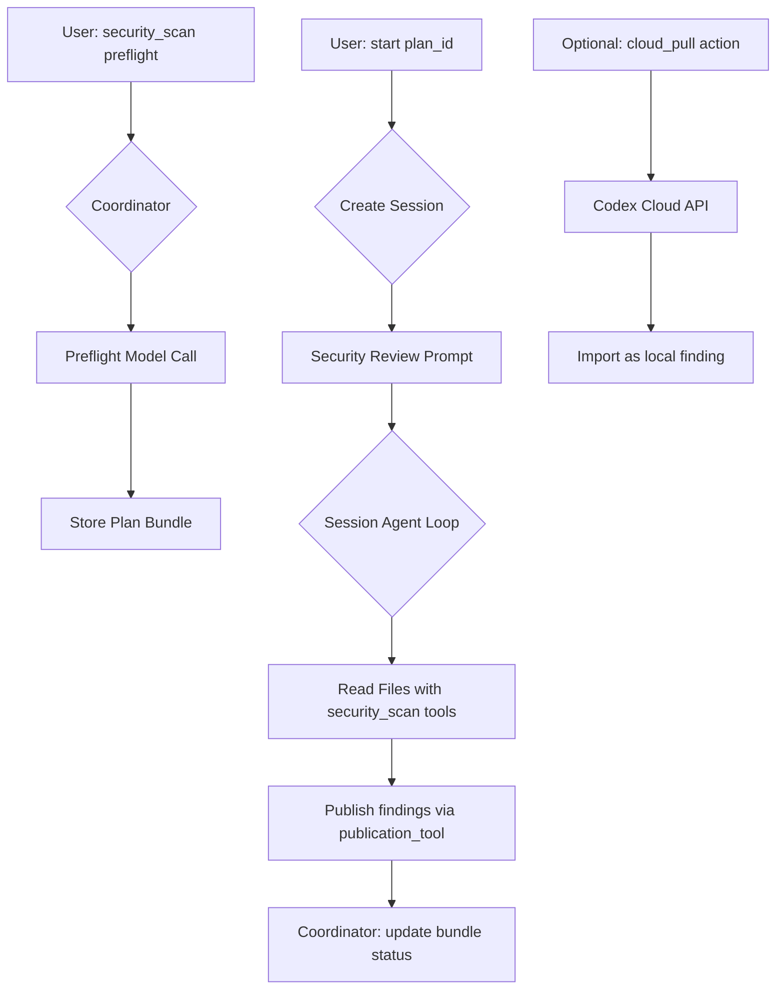

# Oh My Pi (OMP) 软件架构分析报告 — v17.2.x

**分析日期**: 2026-08-02  
**版本范围**: 17.2.x（当前 17.2.4）  
**主要入口**: `packages/coding-agent/src/cli.ts` → `omp CLI`

---

> **注意**: 本文档记录了 OMP v17.2+ 的核心架构变更，重点关注安全扫描系统、Provider Registry 重构和 Worker 隔离机制。

---

## 📋 目录

- [1. 新增核心功能](#1-新增核心功能)
- [2. 安全扫描系统架构](#2-安全扫描系统架构)
- [3. Provider Registry 与 Catalog 分离](#3-provider-registry-与-catalog-分离)
- [4. Worker 进程隔离模型](#4-worker-进程隔离模型)
- [5. Rust Crate 演进](#5-rust-crate-演进)
- [6. 工具系统扩展](#6-工具系统扩展)

---

## 1️⃣ 新增核心功能

### 1.1 Codex Security 扫描系统 (v17.2+)

OMP v17.2 引入了一套完整的本地安全扫描框架，支持 OMP-native 扫描和 Cloud-based 扫描的混合工作流。

**核心组件**:
- `security-scan` — 统一的扫描工具入口
- `SecurityCoordinator` — 协调器管理所有扫描操作的生命周期
- `SecurityStore` — 持久化存储扫描计划和结果 (SARIF bundle)
- `CodexSecurityCloudClient` — Cloud API 客户端

**工作流**:


### 1.2 Provider Registry 分层架构

v17.2x 将供应商系统拆分为两个层次：

**Layer 1 - Protocol Implementations (`providers/`)**  
实现具体的 LLM API 协议（Anthropic、OpenAI Responses、Google Gemini 等）

**Layer 2 - Vendor Registry (`registry/`)**  
可插拔的第三方供应商注册表，支持 API-key OpenAI-compatible providers：
- `aiand.ts` — ai& API provider
- `exa.ts` — Exa search API
- `gmi-cloud.ts` — GMI Cloud
- `novita.ts` — Novita AI
- `xai.ts` — xAI

### 1.3 Worker 进程隔离增强

关键 ML/Audio Workers 现在运行在独立的子进程中，避免 N-API terminator crash (issue #160)：

```typescript
// cli.ts worker dispatch table
__omp_worker_tiny_inferences       → subprocess: ONNX/Transformers inference
__omp_worker_stt                   → subprocess: speech-to-text
__omp_worker_tts                   → subprocess: text-to-speech  
__omp_worker_mnemopi_embed         → subprocess: memory embedding

// Thread-based workers (same process)
__omp_worker_stats_sync            → worker_thread
__omp_worker_terminal_output       → worker_thread
```

---

## 2️⃣ Codex Security Scan System Architecture

### 2.1 Overview

安全扫描系统为 OMP-native repository 提供可配置的安全审查工作流，支持以下目标类型：

| Target Kind | Description | Coverage Mode |
|-------------|-------------|---------------|
| `repository` | Full repo scan | repository-wide |
| `scoped_path` | Specific paths only | scoped_path |
| `working_tree` | Uncommitted changes | working_tree |
| `ref_diff` | Commit diff comparison | diff-based |

### 2.2 Core Components

#### SecurityCoordinator (协调器)

单例模式，按工作目录 + session ID 键管理活跃操作：

```typescript
class SecurityCoordinator {
    #operations: Map<string, SecurityOperationRecord>
    
    async preflight(input): Promise<SecurityScanPlan>
        // 创建不可变的扫描计划，绑定到 repo snapshot、模型和 OAuth credential
    
    async start(planId): Promise<Snapshot>
        // 启动后台作业，支持异步任务管理器或独立进程
    
    async status(operationId)
    
    async cancel(operationId)
    
    async wait(operationId): Promise<Snapshot>
}
```

**关键特性**:
- ✅ **幂等性恢复**: 自动检测中断操作并标记为失败状态
- ✅ **异步作业管理**: 支持 `asyncJobManager` 进行进度报告
- ✅ **Git Adapter**: 支持 diff-based 扫描的工作树隔离
- ✅ **信号处理**: AbortSignal 传播到子 session

#### SecurityStore (存储)

基于 Bun SQLite 的 bundle 存储：

```typescript
interface SecurityBundle {
    scan: {
        documentType: "omp-security.scan"
        schemaVersion: "1.0"
        id: string
        projectKey: string
        status: "running" | "completed" | "failed"
        plan: SecurityScanPlan
        target: SecurityTargetRequest
        findings: Finding[]  // SARIF format
    }
}
```

#### SecurityPublicationTool (发布工具)

扫描 session 专用工具，负责：
1. 验证指纹和证据链完整性
2. 生成 OMP-owned ID（`createSecurityEvidenceId()`）
3. 写入 canonical store
4. 创建 SARIF bundle

### 2.3 Data Flow



### 2.4 Security Scan Workflow States

| Phase | Description | Trigger |
|-------|-------------|---------|
| `queued` | Operation scheduled, awaiting session | start() called |
| `preparing` | Output directory created, target prepared | Before review |
| `reviewing` | OMP worker reviewing files | Session prompt sent |
| `publishing` | Publication tool writing results | findings published |
| `completed` | All findings processed successfully | Bundle written |
| `partial` | Session ended without canonical result | Error during session |
| `cancelled` | User or signal aborted operation | AbortSignal fired |
| `failed` | Unrecoverable error occurred | Exception caught |

### 2.5 Security Evidence Model

```typescript
interface SecurityEvidence {
    id: string          // fingerprint + validation label + index
    kind: "validation" | "other"
    label: string       // human-readable identifier (e.g., "line-42")
    explanation: string // Why this is evidence
}

type ValidationStatus = 
    | 'unvalidated'
    | 'validated'  
    | 'rejected'
    | 'partial'
    | 'error';
```

---

## 3️⃣ Provider Registry & Catalog Separation (v17.2)

### 3.1 Architecture Change

之前的架构：单一 `packages/ai/providers` 目录包含所有供应商实现。

**新架构**: 
- **Protocol Layer** (`providers/`) — 协议实现（Anthropic, OpenAI Responses, etc）
- **Registry Layer** (`registry/`) — API-key based vendor registration

### 3.2 Registry Implementation

```typescript
// registry/registry.ts - Main entry point
export function registerProvider(
    id: string, 
    providerConfig: ProviderConfiguration
): void;

interface ProviderConfiguration {
    apiKeyValidation: ApiKeyValidator;
    defaultEndpoint?: string;
    billingAdapter?: BillingAdapter;
}
```

**Registered Providers (v17.2)** — `registry/` 现覆盖 70+ 供应商，全部通过 `registerProvider()` 注册：

| 类别 | 供应商 |
|------|--------|
| 第一方/OAuth | `anthropic`, `openai`, `openai-codex`, `openai-codex-device`, `google`, `google-vertex`, `google-gemini-cli`, `google-antigravity`, `azure`, `amazon-bedrock`, `cursor`, `devin`, `github-copilot`, `gitlab-duo`, `gitlab-duo-workflow`, `opencode-go`, `opencode-zen`, `meta` |
| 直连 API | `xai`, `xai-oauth`, `zai`, `kimi-code`, `moonshot`, `openrouter`, `deepseek`, `groq`, `fireworks`, `together`, `cerebras`, `mistral`, `nvidia`, `baseten`, `coreweave`, `vllm`, `lm-studio`, `llama-cpp`, `ollama`, `ollama-cloud`, `parallel` |
| OpenAI 兼容 API-key | `novita`, `aiand`, `gmi-cloud`, `umans`, `venice`, `wafer-serverless`, `aimlapi`, `nanogpt`, `sakana`, `kilo`, `zenmux`, `siliconflow`, `siliconflow-cn`, `qianfan`, `qwen-portal`, `minimax`, `minimax-code`, `minimax-code-cn`, `zhipu-coding-plan`, `alibaba-coding-plan`, `alibaba-token-plan`, `xiaomi`, `xiaomi-token-plan-cn/ams/sgp`, `cloudflare-ai-gateway`, `vercel-ai-gateway`, `litellm`, `huggingface` |
| 搜索/检索 | `exa`, `tavily`, `kagi`, `perplexity` |
| 基础设施 | `api-key-login`, `api-key-validation`, `firepass`, `derived`, `synthetic`, `oauth/` |

### 3.3 Catalog Resolution Flow

```mermaid
graph LR
    A[Model String: "anthropic/claude-3"] --> B{Resolver}
    
    C["catalog/provider-models/<provider>.ts"] --> D[Provider Resolver]
    E["registry/<id>.ts"] --> F[Vendor Registry Entry]
    
    G[Settings.enabledModels] --> H[Model Filter]
    I[Settings.disabledProviders] --> J[Exclusion List]
    
    K[Merged Result] --> L[@oh-my-pi/pi-catalog/models.json]
```

---

## 4️⃣ Worker Process Isolation Model (v17.2 Enhanced)

### 4.1 Single Entry Point Pattern

所有 Workers 复用 `cli.ts`，通过隐藏 argv selector 路由：

```typescript
// cli.ts - Central dispatcher
runWorkerEntrypoint(selector: string): void {
    switch (selector) {
        case '__omp_worker_tiny_inference':
            // subprocess spawn with IPC
            import('./tiny/worker').then(worker => worker.main());

        case '__omp_worker_computer':
            // desktop capture / CUA actions (worker_thread)
            startComputerWorker();

        case '__omp_worker_stats_sync':
            // shared thread, no isolation needed
            import('../stats/sync-worker');

        case '__omp_daemon_broker':
            // daemon process management  
            import('./launch/broker');
    }
}
```

### 4.2 Subprocess vs Thread Workers

| Worker Type | Location | IPC Method | Use Case |
|-------------|----------|------------|----------|
| **Subprocess** | `tiny/worker.ts` | process.send() | ONNX inference, ML models |
| **Subprocess** | `eval/js/process-entry` | process.send() | JS eval kernel (隔离用户负载) |
| **Subprocess** | `stt/asr-worker` · `tts/tts-worker` · `mnemopi/embed-worker` | process.send() | 语音识别 / 语音合成 / 记忆嵌入 |
| **Thread** | `stats/sync-worker` | Shared memory | Fast sync ops |
| **Thread** | `tools/browser/tab-worker-entry` | parentPort inbox | 浏览器标签页 |
| **Thread** | `tools/computer/worker-entry` | parentPort inbox | 桌面捕获与 CUA 操作 |
| **Daemon Thread** | `launch/broker` | Internal queue | Process lifecycle mgmt |
| **Thread** | `launch/terminal-output-worker` | parentPort inbox | 守护进程终端输出 |

### 4.3 Isolation Benefits

1. ✅ **N-API Safety**: Audio/ML workers crash doesn't affect main process
2. ✅ **Memory Boundaries**: Each worker has isolated heap
3. ✅ **Graceful Shutdown**: Parent can SIGKILL child on exit (#160)
4. ✅ **Resource Limits**: Per-worker memory/CPU caps possible

### 4.4 Worker Lifecycle Management

```typescript
class WorkerHost {
    #children: Map<string, ChildProcess>
    
    spawnWorker(workerType: string): void {
        const child = Bun.spawn(['bun', 'cli.ts', `__omp_${workerType}`], {
            stdout: 'pipe', stderr: 'inherit'
        });
        
        // Track for cleanup on parent exit
        process.on('exit', () => this.killAll());
    }
    
    killAll(): void {
        for (const child of this.#children.values()) {
            child.process.kill('SIGTERM');
        }
    }
}
```

---

## 5️⃣ Rust Crate Evolution (v17.x)

### 5.1 Pi-Natives Split

原始的 `pi-natives` crate 已拆分为多个专用 crates：

| Crate | Purpose | Lines of Code | Key Features |
|-------|---------|---------------|--------------|
| **pi-voice** | Audio I/O + WebRTC | ~8k | Microphone capture, audio playback, real-time dialogue |
| **pi-natives** | Core bindings | ~35k | grep, fd access, clipboard, syntax highlighting, sixel |
| **pi-shell** | PTY/Shell execution | ~12k | Process management, snapshot support, cross-platform |
| **pi-ast** | AST operations | ~6k | tree-sitter integration, code queries |

### 5.2 New Crates (v17+)

```
crates/
├── pi-natives          ← Core N-API bindings (grep, fd, clipboard)
├── pi-voice            ← Audio/WebRTC real-time dialogue
├── pi-shell            ← PTY/process management with snapshots  
├── pi-mnemopi          ← Memory embedding engine (ONNX/Transformers)
├── pi-collab           ← Real-time collaboration protocol
└── vendor/{...}        ← Third-party dependencies
```

---

## 6️⃣ Tool System Extensions (v17.2 Updates)

### 6.1 Security Scan Tool (`security_scan`)

**Purpose**: Run OMP-native and Codex cloud security scans

**Actions**:
| Action | Parameters | Description |
|--------|------------|-------------|
| `preflight` | target, knowledge_base_paths | Create immutable scan plan |
| `start` | plan_id | Execute as background job |
| `status` | operation_id | Check progress |
| `cancel` | operation_id | Abort running scan |
| `validate` | finding_id, validation_status | Mark findings as validated/rejected |

**Parameters**:
```typescript
interface SecurityScanParams {
    action: 'preflight' | ...
    target_kind?: 'repository' | 'scoped_path'| 'working_tree' | 'ref_diff';
    include_paths?: string[];
    exclude_paths?: string[];
    cloud_configuration_id?: string;  // For cloud actions
}
```

### 6.2 Security Publish Tool (`security_publish`)

**Purpose**: Canonicalize and publish scan results

**Constraints**:
- ✅ Must be called exactly once per in-scope file disposition
- ✅ Evidence must be grounded in inspected files only  
- ❌ Cannot invent IDs or edit store directly

---

## 7️⃣ Configuration Updates (v17.2 Settings)

### 7.1 New Security Settings

```yaml
security:
    enabled: false                   # 默认关闭；开启安全扫描系统
    cloud_allowance_check: false     # Warn before consuming cloud quota
    
memory:
    backend: 'off' | 'local' | 'mnemopi' | 'hindsight'
    
providers:
    tinyModelDevice: cpu             # ONNX 推理设备 (GPU/CPU)
    tinyModelDtype: q4               # 精度 (fp16/bf32/q4)

task:
    max_recursion_depth: 2           # Subagent depth limit
    isolation_mode: 'none'           # 'none' | 'auto' | 'apfs' | 'btrfs' | 'zfs' | 'reflink' | 'overlayfs' | 'projfs' | 'block-clone' | 'rcopy'
```

### 7.2 Tool Activation Rules

| Setting | Default | Description |
|---------|---------|-------------|
| `security.enabled` | false | Enable security_scan and security_publish tools |
| `tools.approval_mode` | yolo | Tool approval mode (`yolo` 自动执行) |
| `tools.xdev` | true | Mount discoverable tools as xd:// virtual devices |
| `ask.enabled` | true | Enable interactive ask tool |
| `browser.enabled` | true | Enable browser tool |

---

## 8️⃣ Internal URL Protocol Extensions (v17.2 Added)

### 8.1 security:// Protocol

New internal protocol for accessing security scan results:

```bash
# Read security findings from a specific scan
read security://scan-abc123/finding-def456

# List all scans in current repository  
search security://scans --glob "*completed*"

# Validate finding evidence
security_scan validate \
    scan_id=abc123 \
    finding_id=def456 \
    validation_status=validated \
    validation_summary="Confirmed vulnerability"
```

### 8.2 Protocol Registry Updates

| Protocol | File Location | Purpose |
|----------|---------------|---------|
| `security://` | `internal-urls/security-protocol.ts` | Security scan results access |
| `xd://` | `tools/xdev.ts` | Virtual device mounting for discoverable tools |

---

## 9️⃣ Build & Release Process (v17.2 Changes)

### 9.1 Compilation Pipeline

```bash
# Main build targets
bun run build:binary       # Compile standalone binary with embedded wasm/natives
bun check                  # Type checking + linting  
bun test                   # Full test suite
bun run release            # Version bump, changelog, publish to npm

# Docker builds
docker build -t omp .                    # Standard image
docker build --target robot -t omp-robot .  # Unattended deployment
```

### 9.2 Release Checklist (v17)

- [ ] Update `docs/architecture-analysis.md` with new features  
- [ ] Add entries to package/*/CHANGELOG.md under `[Unreleased]`
- [ ] Verify all worker smoke tests pass (`bun test --smoke`)
- [ ] Test security scan workflow end-to-end (native + cloud)

---

## 🔟 Key Design Decisions Summary

### 10. Security Architecture Principles

| Principle | Rationale | Implementation |
|-----------|-----------|----------------|
| **Immutable Plans** | Prevent tampering mid-scan | Plan pinned to repo snapshot, model, OAuth credential |
| **Separation of Concerns** | Native vs Cloud scanning are different workflows | Separate `security_scan` (native) and `cloud_*` actions |
| **Canonical Store** | Single source of truth for findings | SQLite-backed bundle with SARIF export |
| **Evidence Chain** | Audit trail for all validations | Each evidence item has unique ID + explanation |

### 10. Worker Isolation Rationale

- ✅ Prevents N-API terminator crashes (#160)  
- ✅ Enables per-worker resource limits  
- ✅ Allows independent restart/recovery  

### 10. Provider Registry Benefits

| Benefit | Before (v17.0-) | After (v17.2-) |
|---------|-----------------|----------------|
| **Extensibility** | Hard to add new vendors | Plugin-based registration |
| **Maintainability** | Monolithic providers/ dir | Separated protocol vs registry layers |
| **Testing** | Difficult mock isolation | Each provider can be tested independently |

---

## 📚 References & Related Documentation

- [Security Scan Tool Guide](../tools/security-scan.md) — Detailed usage  
- [Codex Security Architecture](../security/cloud.md) — Cloud integration details  
- [Provider Registry Design](../adding-a-provider.md) — Adding new vendors  
- [Worker Isolation Best Practices](../native-crates.md#worker-isolation)  

---

## 📝 Revision History

| Version | Date | Changes |
|---------|------|---------|
| 17.2.4 | 2026-08 | 注册表扩展至 70+ 供应商、computer 桌面 CUA worker、默认值修正 |
| 17.2 | 2026-** | Added security scan system architecture |
| 17.1 | 20**-** | Initial provider registry separation |  
| 17.0 | 20**-** | Worker subprocess isolation model |

---

*Generated by Oh My Pi Architecture Analysis Tool — v17.2.4.*
